Summary

    CookBook App is a cross-platform mobile application built with Flutter. This application is your ultimate companion for discovering and mastering the rich heritage of Vietnamese recipes****

### User Interfaces

|                             Screen                              |                          Screen                           |                                Screen                                 |                               Screen                               |                               Screen                               |
|:---------------------------------------------------------------:|:---------------------------------------------------------:|:---------------------------------------------------------------------:|:------------------------------------------------------------------:|:------------------------------------------------------------------:|
|    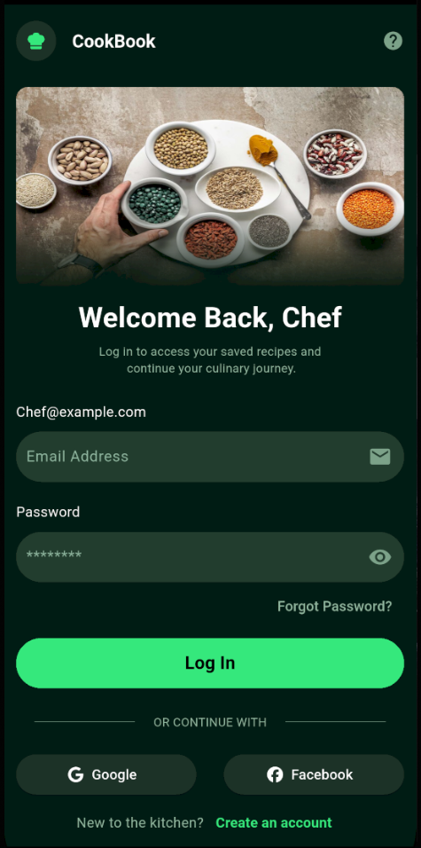     |  | 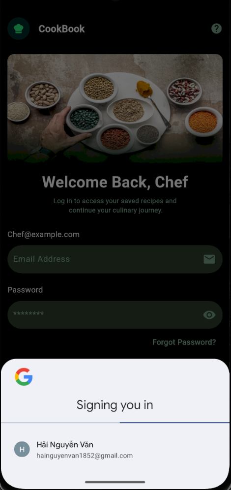 |  | 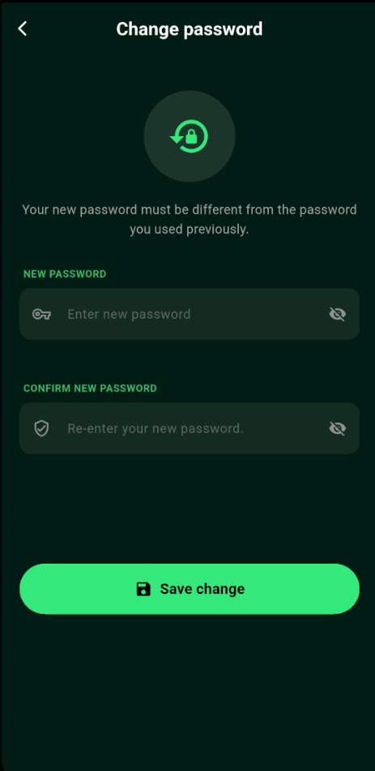 |
|   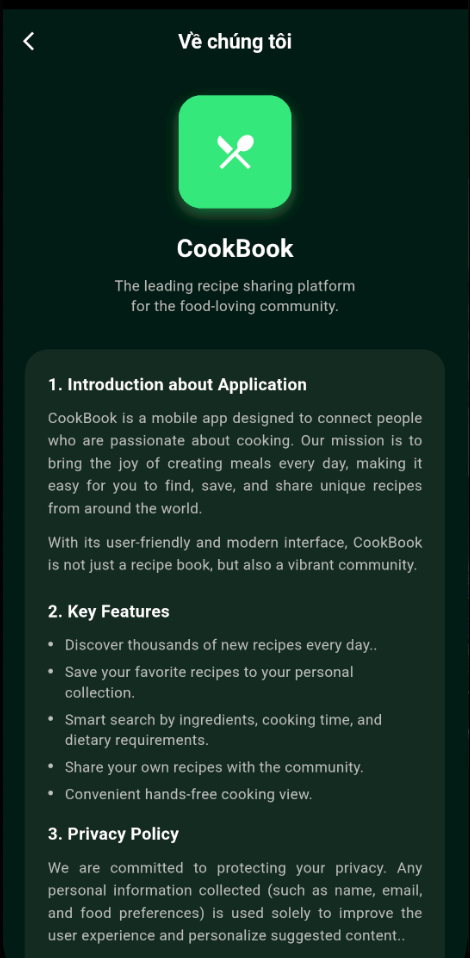   | 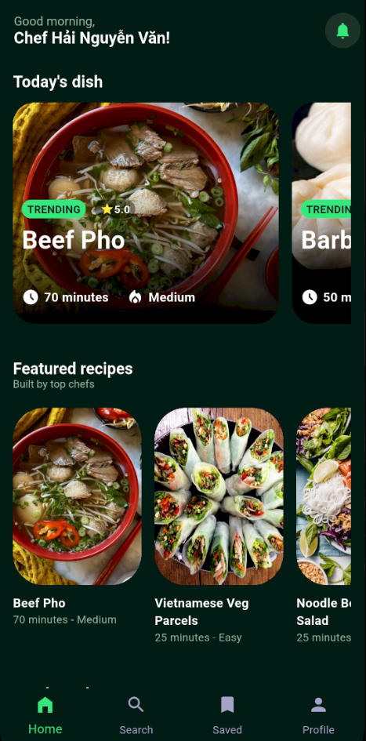 |       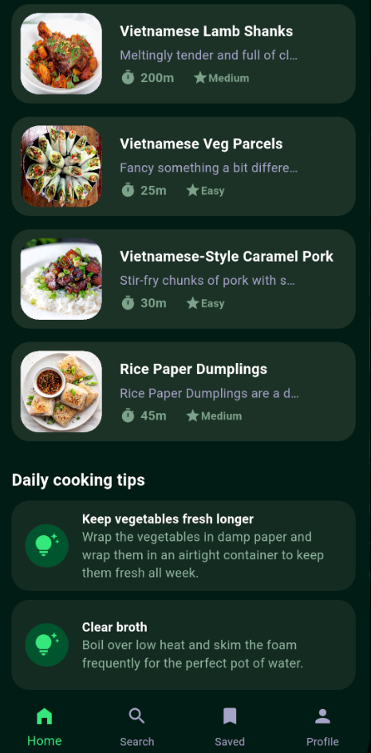       |     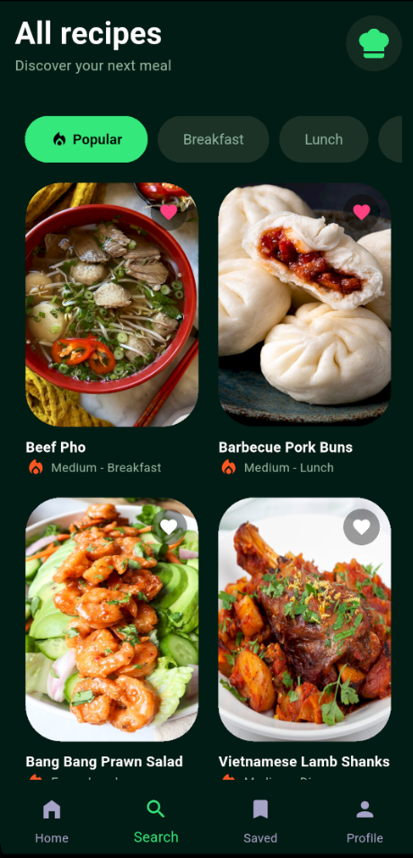      |      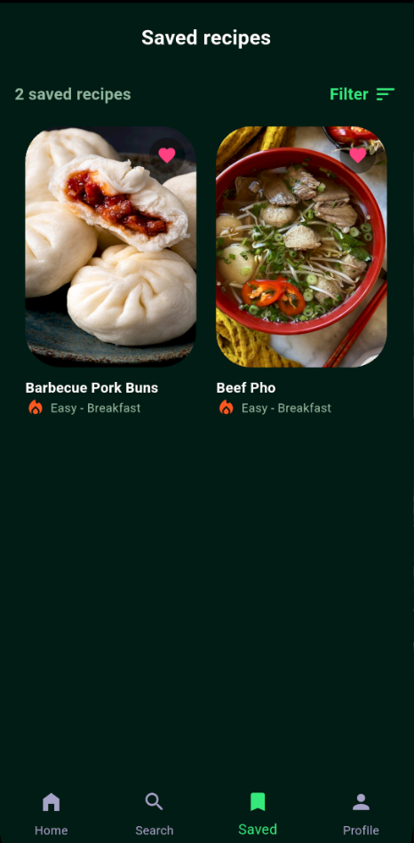      |
|   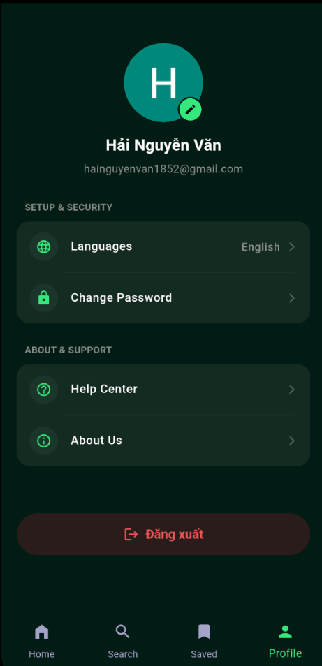    |  |    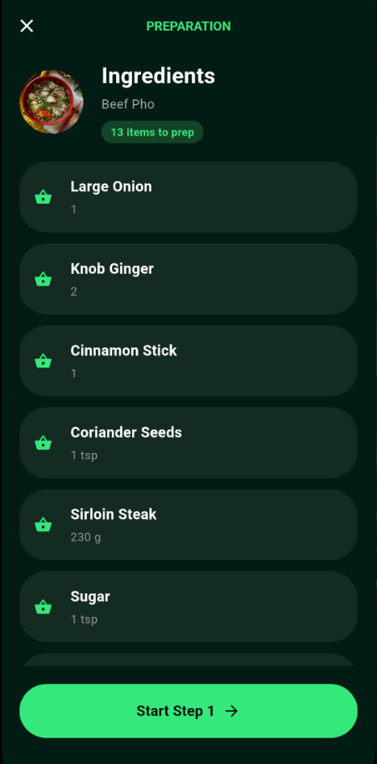     |  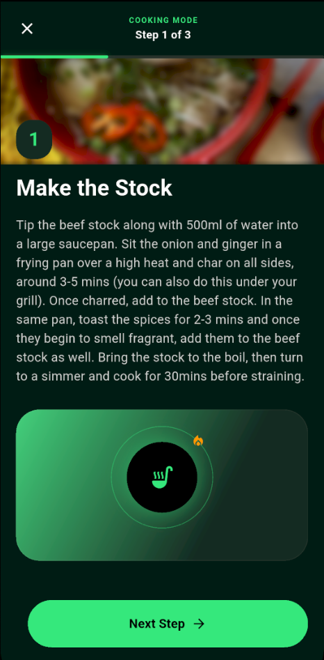   |    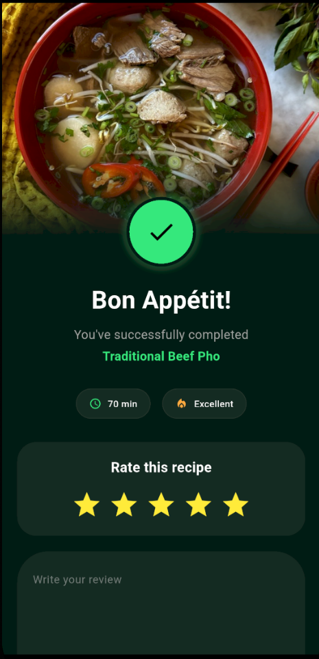     |
| 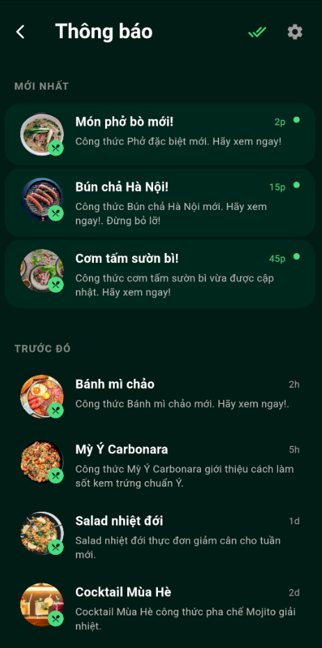 |                                                           |                                                                       |                                                                    |                                                                    |


Technologies

    Framework: Flutter (Dart)
    
    Backend: Supabase - Use services like Database, Authentication, Edge Fuctions and Storage.
    
    State Management: Cubit/BLoC
    
    Database: Supabase - Store and manage data efficiently.
    
    Authentication: Supabase Authentication - Manage registration and login securely for users include: Email, Google.

Project Structure

```
lib
├── main.dart        
│
├── assets 
│   ├── images         
│   └── icons  
│
├── core                   
│   ├── themes        
│   └── errors      
│
└── features           
    ├── authentication 
    │   ├── data
    │   │   ├── datasources
    │   │   ├── models   
    │   │   └── repositories
    │   ├── domain
    │   │   ├── entities   
    │   │   ├── repositories
    │   │   └── usecases  
    │   └── presentation
    │       ├── bloc     
    │       ├── pages   
    │       └── widgets
    │
    └── view_recipes 
        ├── data
        │   ├── datasources 
        │   ├── models     
        │   └── repositories
        ├── domain
        │   ├── entities  
        │   ├── repositories
        │   └── usecases  
        └── presentation
            ├── bloc    
            ├── pages     
            └── widgets   
```

